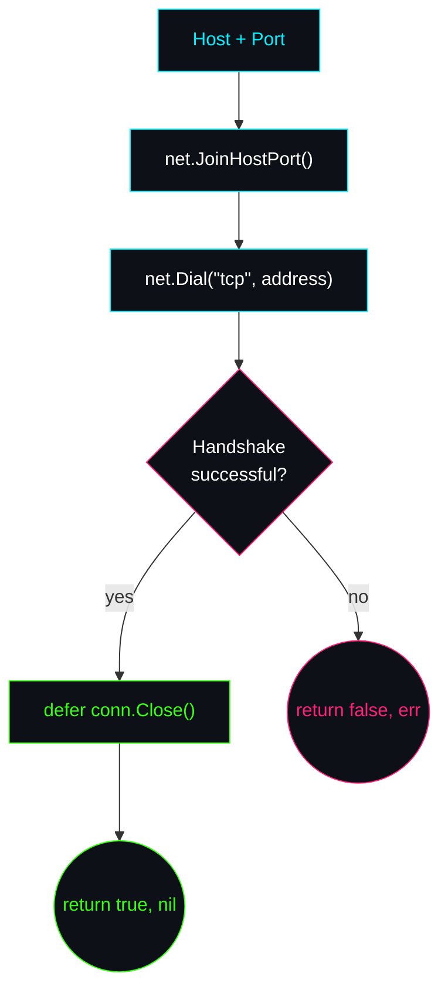

<div align="center">

```
┌────────────────────────────────────────────┐
│   D A Y   0 3   ::   N E T W O R K I N G    │
│   T C P   P O R T   S C A N N E R           │
└────────────────────────────────────────────┘
```


-FF2079?style=for-the-badge&labelColor=0D1117)

</div>

<br>

## 🎯 Objective

Build a simple TCP port scanner while learning Go's approach to networking, multiple return values, error handling, and resource management.

<div align="center">

━━━━━━━━━━━━━━━━━━━━━━━━━━━━━━━━━━━━━━━━━━━━━━━━━━━━━━━━━━━━━━━━━━━━

</div>

## ⚙️ Engineering Problem

A port scanner needs to answer one deceptively simple question:

> **"Can I establish a TCP connection to this host and port?"**

Unlike a plain boolean check, a networking operation can fail for very different reasons — and those reasons matter:

| Failure Mode | What It Actually Means |
|---|---|
| 🔒 Port closed | Nothing is listening — expected, not an error |
| 🌐 Hostname unresolvable | DNS failed before a connection was ever attempted |
| 📡 Network unavailable | The local machine can't even reach the network |
| 🧱 Firewall filtering | The connection was silently dropped, not refused |
| ⏱️ Connection timed out | No response — could be filtering, could be latency |

A boolean can't tell these apart. This project explores how Go communicates those outcomes using **explicit error values** instead of collapsing them into a single `true`/`false`.

<div align="center">

━━━━━━━━━━━━━━━━━━━━━━━━━━━━━━━━━━━━━━━━━━━━━━━━━━━━━━━━━━━━━━━━━━━━

</div>

## 🧩 Concepts Covered

```
net package
net.Dial()
net.JoinHostPort()
Multiple return values
error
defer
Resource cleanup
strconv.Itoa()
```

<div align="center">

━━━━━━━━━━━━━━━━━━━━━━━━━━━━━━━━━━━━━━━━━━━━━━━━━━━━━━━━━━━━━━━━━━━━

</div>

## 🛠️ The Project

The application attempts to establish a real TCP connection to a specified host and port.

- If the TCP handshake **succeeds**, the port is considered open.
- If the connection **cannot be established**, the function returns an error explaining why.

### Function Signature

```go
func ScanPort(host string, port int) (bool, error)
```

| Return Value | Meaning |
|---|---|
| `bool` | Whether the TCP connection succeeded |
| `error` | Why the connection could not be established, if applicable |

<div align="center">

━━━━━━━━━━━━━━━━━━━━━━━━━━━━━━━━━━━━━━━━━━━━━━━━━━━━━━━━━━━━━━━━━━━━

</div>

## 🔀 Connection Flow



<div align="center">

━━━━━━━━━━━━━━━━━━━━━━━━━━━━━━━━━━━━━━━━━━━━━━━━━━━━━━━━━━━━━━━━━━━━

</div>

## 🧭 Engineering Decisions

<table>
<tr><td>

**Why `net.JoinHostPort()`?**

Instead of manually formatting strings with `fmt.Sprintf`, the project uses `net.JoinHostPort()` because it correctly handles IPv4, hostnames, *and* IPv6 addresses — bracket-wrapping included. A hand-rolled `host + ":" + port` string quietly breaks on IPv6.

</td></tr>
<tr><td>

**Why return `(bool, error)`?**

The caller needs two pieces of information: *was the port open*, and *if the scan failed, why*. Returning only a boolean throws away the debugging information that separates "closed port" from "your DNS is broken."

</td></tr>
<tr><td>

**Why use `defer`?**

Once a TCP connection is established, it becomes an operating-system resource. `defer conn.Close()` guarantees the connection is released no matter which path the function takes to return — success, early failure, or panic.

</td></tr>
</table>

<div align="center">

━━━━━━━━━━━━━━━━━━━━━━━━━━━━━━━━━━━━━━━━━━━━━━━━━━━━━━━━━━━━━━━━━━━━

</div>

## 🧠 Lessons Learned

- Networking APIs should return enough information for callers to make informed decisions — not just a verdict.
- A closed port is not necessarily a programming error; it's a valid outcome the caller needs to distinguish from a *broken* scan.
- `defer` makes resource cleanup reliable and easy to maintain, instead of relying on remembering to close things at every exit point.
- The Go standard library provides networking abstractions (`net.JoinHostPort`, `net.Dial`) that are safer than manually manipulating strings.

<div align="center">

━━━━━━━━━━━━━━━━━━━━━━━━━━━━━━━━━━━━━━━━━━━━━━━━━━━━━━━━━━━━━━━━━━━━

</div>

## ⏭️ Next Step

Expand the scanner to inspect **multiple ports concurrently** and organize the project into reusable components — the natural on-ramp into Go's concurrency model.

<div align="center">

━━━━━━━━━━━━━━━━━━━━━━━━━━━━━━━━━━━━━━━━━━━━━━━━━━━━━━━━━━━━━━━━━━━━

**⬅ Back to** [`Go Cloud Security Lab`](../README.md)

</div>
