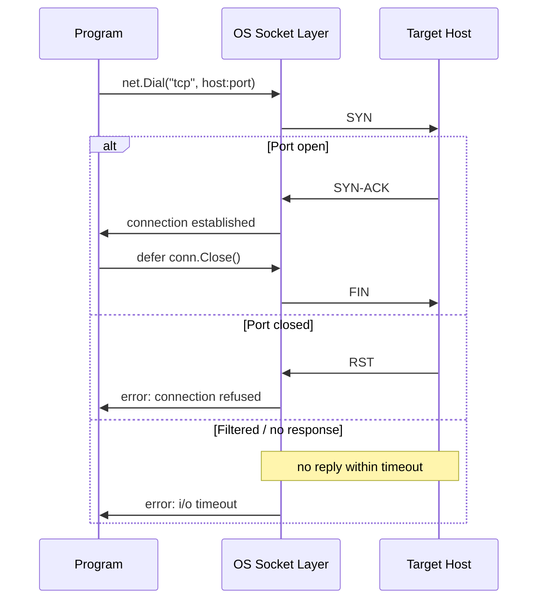
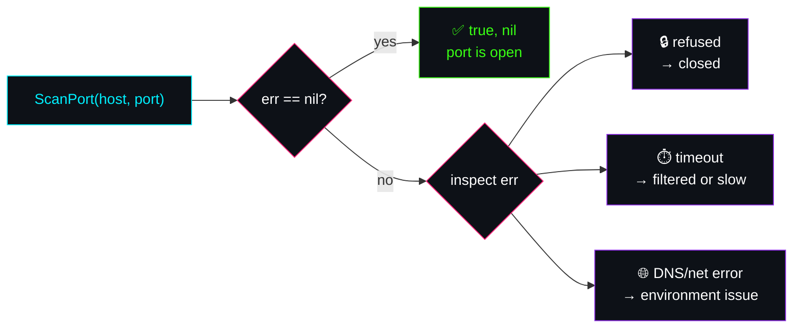

 

<table width="100%">
<tr>
<td align="center" width="25%">

**CONCEPT**
`net + error`

</td>
<td align="center" width="25%">

**LAYER**
`L4 · TCP`

</td>
<td align="center" width="25%">

**STATUS**
🟢 `COMPLETE`

</td>
<td align="center" width="25%">

**DIFFICULTY**
`▰▰▰▱▱`

</td>
</tr>
</table>

<br>

> ### 🎯 The Question This Project Answers
> **"Can I establish a TCP connection to this host and port?"**
> That sounds like a yes/no question. It isn't — and this project is about *why*.

<br>

## 📡 Why This Isn't a Boolean Problem

A port scan can fail for reasons that all *look* the same from the outside but mean completely different things to the person operating the system:

<table>
<tr><th>Signal</th><th>What Actually Happened</th><th>Operator Response</th></tr>
<tr><td>🔒 Closed</td><td>Nothing is listening on that port</td><td>Expected — not an incident</td></tr>
<tr><td>🌐 DNS failure</td><td>The hostname never resolved</td><td>Check DNS, not the target</td></tr>
<tr><td>📡 Network unreachable</td><td>Local machine has no route out</td><td>Check your own network stack</td></tr>
<tr><td>🧱 Filtered</td><td>A firewall silently dropped it</td><td>Expected in hardened environments</td></tr>
<tr><td>⏱️ Timeout</td><td>No response at all</td><td>Could be filtering, could be latency</td></tr>
</table>

A single `bool` erases every row of that table down to one bit. This project is about refusing to make that trade.

<br>

## 🔬 How the Scan Actually Works

**The handshake, moment to moment:**



**What the caller does with the result:**



<br>

## 🛠️ The Signature

```go
func ScanPort(host string, port int) (bool, error)
```

| Returns | Answers |
|---|---|
| `bool` | Did the TCP handshake succeed? |
| `error` | If not — why, specifically? |

<br>

## 🧭 Engineering Decisions

<details>
<summary><b>Why <code>net.JoinHostPort()</code> instead of <code>fmt.Sprintf()</code>?</b></summary>
<br>

Hand-formatting `host + ":" + port` quietly breaks the moment `host` is an IPv6 address — `2001:db8::1:8080` is ambiguous garbage without bracket-wrapping. `net.JoinHostPort()` handles IPv4, hostnames, and IPv6 correctly, every time, without the caller needing to know the difference.
</details>

<details>
<summary><b>Why return <code>(bool, error)</code> instead of just <code>bool</code>?</b></summary>
<br>

The caller needs two answers, not one: *was it open*, and *if not, why*. Collapsing that to a single boolean throws away exactly the information in the table above — the difference between "closed" and "your DNS is broken" disappears.
</details>

<details>
<summary><b>Why <code>defer conn.Close()</code>?</b></summary>
<br>

A live TCP connection is an OS-level resource (a file descriptor under the hood). `defer` guarantees it's released no matter which of the three branches in the sequence diagram above the function takes — success, refusal, or timeout — without needing a `Close()` call duplicated at every return point.
</details>

<br>

## 💡 Lessons Learned

- Networking APIs should return enough information for callers to make informed decisions — not just a verdict.
- A closed port is a valid outcome, not a bug — the scanner's job is to distinguish it from a *broken scan*, not to treat every failure the same.
- `defer` turns resource cleanup from "something I have to remember" into "something the language guarantees."
- The standard library's networking primitives (`net.JoinHostPort`, `net.Dial`) are safer than hand-rolled string formatting — they encode years of edge cases I'd otherwise hit one at a time.

<br>

## ⏭️ Next Step

> Expand the scanner to inspect **multiple ports concurrently**, and split the project into reusable components — the natural on-ramp into Go's concurrency model.

<br>


**⬅ Back to** [`day-03 notes`](./notes.md) · [`Go Cloud Security Lab`](../README.md)
